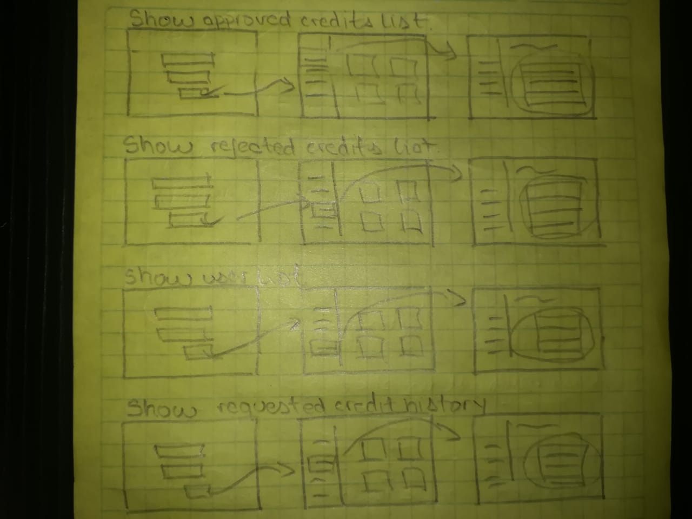

# UBanco

A new Personal Microcredit Platform

## Reason why

Productivity depends, among many other variables, on the initial capital investment. On the other hand, in South America it's difficult to obtain financing to develop a project. Therefore, to improve the region's productivity, new sources of financing must be found for providing opportunities

### Intention

UBanco was born as a proposal to facilitate financing. We believe in the region's individual capacity to innovate and grow in a more connected and interdependent world.

## Brand Development

### Philosophy

- **Help:** Social cooperation is essential.
- **Love:** Desire and do good to all people, without any particular interest.
- **Peace:** Avoid conflicts, discussions and misunderstandings.

### The identifier

Bank is a polysemic word that can mean: Long and narrow seat for several people or Public credit establishment. Based on this idea, an approach to both parties is sought, linking the principle love of your philosophy. Love is related to the heart's icon, so a bank with that profile can be an interesting proposal. Part of the concept's development on paper is detailed here:

and the end result is

## Requirements

- Create a loan component that allows the user to choose the amount for request
  between a minimum value and a maximum value (eg vlr. min. 10,000 - vlr. max. 100,000).

- Save the initial bank capital

- Create a component that is always visible with the bank's base amount and it must
  change according to the loans and payments that are made. Example (base amount:
  $ 1,000,000 and the bank makes a loan for $ 100,000, the new bank's amount should show up as \$ 900,000)

- The system must create users with the following parameters:
  -- Name
  -- Mail
  -- Identification card
  -- Requested Value
  -- Payment date (optional)
  -- Credit status (approved - rejected)
  -- Credit Payment (yes - no)
  -- You must use the initial loan component to select the credit's value.

- At the time of applying, the system must randomly validate if the credit
  was approved or not, users who are rejected cannot reapply
  credits. The system must show all the users registered in the system, and show the requested credit history for each user.

- The system should show a list of rejected requests and a total amount of denied requests.

- The system should display a list of approved and pending payable requests. (must show amount, name, and payment button).

- The system must allow to request a new credit for those clients who do not have
  outstanding credits.

### The Uses Cases

Based on the requirement, the following use cases were prepared

### The Web Flow

The screens with their interactions are summarized in the following images

## The Architecture

The project is divided into 2 layer:

- Frontend Layer
- Backend Layer

In each layer are the projects that manage the application.
The details to deploy the projects for each layer are on its own README.
